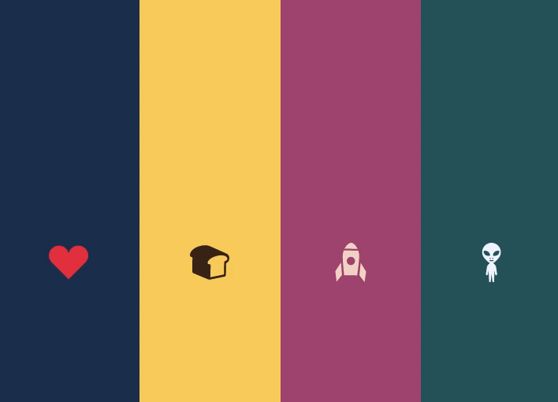

# Animated Like Buttons :thumbsup:

This is part of a monthly hackathon [Cotoron](https://github.com/cotoron/home) for the month of February 2021. Inspired by a like button, I created some small buttons with flat icons, each of which has a hand-coded unique animation. Let's click a button to see what happens!

## Technologies used:

HTML, CSS, SCSS, JavaScript

## Future developments:

- For mobile, add an accordion layout which only shows the colour of each column first and once clicked, the column will expand and show the button.
- For the heart button, set the position of the flying hearts dynamically every time a user clicks it so that each heart flies away differently.
- Be creative and add more buttons!
